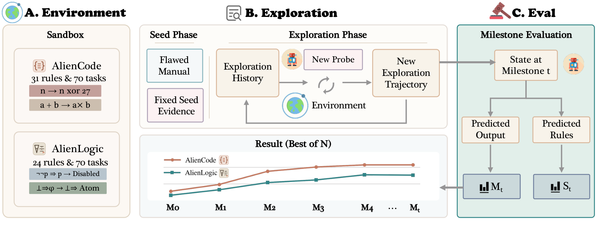
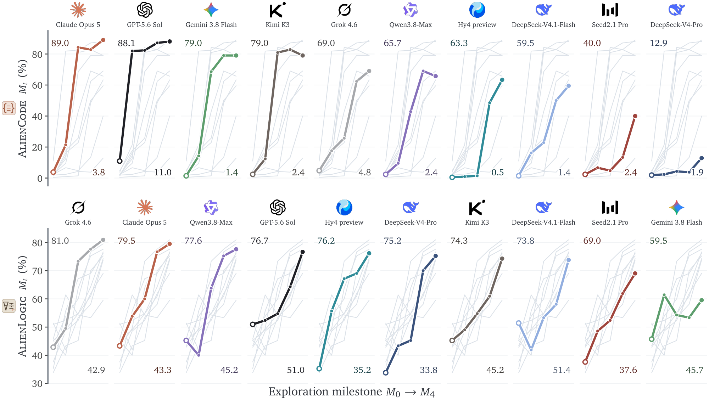

<p align="left">
    <a href="README_CN.md">中文</a>&nbsp;｜&nbsp;English
</p>
<br>

<p align="center">
  <br>
</p>

<h1 align="center">ExplorationBench: Measuring AI Systems' Exploration in Verifiable Alien Worlds</h1>

<div align="center">

[](#-license)
&nbsp;&nbsp;
[](https://arxiv.org/abs/2609.30199)
&nbsp;&nbsp;
[](https://explorationbench.com/#leaderboard)
&nbsp;&nbsp;
[](https://explorationbench.com/blog/)
&nbsp;&nbsp;
[](#-quick-start)

</div>

<p align="center">
    🖥️&nbsp;<a href="https://explorationbench.com"><b>Official Website</b></a>&nbsp;&nbsp;|&nbsp;&nbsp;
    📮&nbsp;<a href="#-evaluate-your-model"><b>Evaluate Your Model</b></a></p>

---

## 🔥 News

- **2026.09**: 🎉 ExplorationBench released — two verifiable Alien Worlds with 55 discovery targets and 140 held-out tasks, and results for 10 frontier AI systems. [[Paper]](https://arxiv.org/abs/2609.30199) [[Website]](https://explorationbench.com) [[Blog]](https://explorationbench.com/blog/)

## 📋 Contents

- [Overview](#-overview)
- [Leaderboard](#-leaderboard)
- [Key Findings](#-key-findings)
- [What Is Released](#-what-is-released)
- [Quick Start](#-quick-start)
- [Repository Structure](#-repository-structure)
- [Evaluate Your Model](#-evaluate-your-model)
- [Related Benchmarks](#-related-benchmarks)
- [License](#-license)
- [Citation](#-citation)
- [Contact](#-contact)

## 📄 Overview

Scientific discovery begins where known problems end. There, AI systems must explore: frame hypotheses, design experiments, and iterate on the results. ExplorationBench measures this ability in **verifiable Alien Worlds**. Their rules are executable, so every answer is checked exactly, and they conflict with familiar knowledge, so recall alone cannot solve the tasks.

A system starts from a flawed manual and a fixed set of worked examples. Over four rounds it probes the world through a single tool, and the world answers with deterministic feedback and no explanation. After every round, a copy of the conversation with tools disabled reports the rules it believes hold and answers every held-out task three times. The copy is then discarded, so test items never leak into exploration.

<p align="center">
  
</p>

*The evaluation protocol. Every system starts from the same flawed manual and the same fixed worked examples and chooses its own probes over four rounds. At every milestone M<sub>t</sub>, a tool-disabled copy reports the rules it believes hold and answers the held-out tasks.*

<p align="center">
  
</p>

*Held-out accuracy over autonomous exploration. Top: AlienCode; bottom: AlienLogic. Each cell highlights one system's M<sub>0</sub>–M<sub>4</sub> curve; the other nine are grey. Each curve is the system's Best@3 trajectory, and each milestone is the mean of three answers per held-out task.*

**Stats**: 2 sandboxes · 55 discovery targets · 140 held-out tasks · 10 frontier systems · 3 independent trajectories per system and sandbox · every verdict from an interpreter or a proof checker, with no LLM judge

**Sandboxes**:
- **AlienCode** — program synthesis in a small calculation language whose familiar-looking operators follow hidden semantics: `SHATTER` multiplies, `EMIT(100)` prints `127`, and no primitive adds. 31 discovery targets and 70 held-out tasks; each program is graded by an interpreter on five private inputs.
- **AlienLogic** — formal proof in a first-order natural-deduction system with 24 patched inference rules. 70 held-out theorems, 25 of them unprovable; a proof checker verifies every proof, and an unprovable theorem scores only when the system declines to prove it.

## 🏆 Leaderboard

Held-out accuracy (%) after four rounds of autonomous exploration (M<sub>4</sub>). **Best@3** is the best of three independent trajectories and **Mean@3** their mean; M<sub>0</sub> is the Best@3 trajectory's accuracy after the worked examples alone. Every score is the mean of three answers per task, and every system runs at its highest reasoning setting. More columns, the control conditions, and interactive trajectories are on the [website](https://explorationbench.com/#leaderboard).

**AlienCode**

| Rank | System | M<sub>0</sub> | Best@3 | Mean@3 |
|:---:|---|---:|---:|---:|
| 1 | Claude Opus 5 | 3.8 | **89.0** | 73.5 |
| 2 | GPT-5.6 Sol | 11.0 | 88.1 | 79.5 |
| 3 | Gemini 3.8 Flash | 1.4 | 79.0 | 39.7 |
| 4 | Kimi K3 | 2.4 | 79.0 | 38.7 |
| 5 | Grok 4.6 | 4.8 | 69.0 | 53.2 |
| 6 | Qwen3.8-Max | 2.4 | 65.7 | 64.0 |
| 7 | Hy4 preview | 0.5 | 63.3 | 30.2 |
| 8 | DeepSeek-V4.1-Flash | 1.4 | 59.5 | 46.3 |
| 9 | Seed2.1 Pro | 2.4 | 40.0 | 24.8 |
| 10 | DeepSeek-V4-Pro | 1.9 | 12.9 | 7.3 |

**AlienLogic**

| Rank | System | M<sub>0</sub> | Best@3 | Mean@3 |
|:---:|---|---:|---:|---:|
| 1 | Grok 4.6 | 42.4 | **83.8** | 72.1 |
| 2 | Claude Opus 5 | 42.9 | 77.6 | 73.3 |
| 3 | Qwen3.8-Max | 43.8 | 76.2 | 72.7 |
| 4 | GPT-5.6 Sol | 51.0 | 75.2 | 73.0 |
| 5 | Hy4 preview | 33.8 | 74.8 | 67.8 |
| 6 | DeepSeek-V4-Pro | 32.9 | 73.8 | 65.1 |
| 7 | Kimi K3 | 44.8 | 72.9 | 67.9 |
| 8 | DeepSeek-V4.1-Flash | 50.0 | 72.4 | 59.2 |
| 9 | Seed2.1 Pro | 37.1 | 67.6 | 59.5 |
| 10 | Gemini 3.8 Flash | 47.6 | 58.1 | 57.6 |

## 💡 Key Findings

- **Exploration, not recall or thinking alone, produces the knowledge the tasks require.** No AlienCode trajectory exceeds 15.7% after the worked examples; after four rounds the best reaches 89.0%. The same number of rounds without environment feedback stays at 0.5–11.0%.
- **Exploration works best when the system designs its own experiments.** Replaying a system's own best probes to it gives it exactly the same evidence, yet in AlienCode autonomous exploration still does better for 9 of 10 systems, by a median of 17.4 points.
- **The two worlds get stuck in different places.** In AlienLogic, being told the rules yields 93–97%, above every system's best trajectory, so discovery is the bottleneck. In AlienCode, the best trajectory beats being told the rules up front for 7 of 10 systems, so using the rules is.
- **Knowing a rule does not guarantee using it correctly.** Tasks whose required rules the final rule report states correctly are still solved only 73.4% of the time.
- **A single score hides a lot.** One system's trajectories under the same budget can end tens of points apart (Kimi K3: 5.7–79.0% in AlienCode), a system's rank in one world barely predicts its rank in the other (Spearman 0.35), and gains arrive in leaps that later rounds can undo.

## 📦 What Is Released

A world whose rules are public measures recall instead of exploration, so the rules and test instances of the two evaluation worlds are kept private. Everything else needed to understand and run the benchmark is here:

- **The evaluation code, as it ran for the paper**: harnesses, protocol, scoring, control conditions, three answers per task, open-book answering, rescoring, and audits. Only the world-specific modules differ, and `explorationbench/sandboxes/code/world_data.py` names every value that does.
- **The evaluation engines**: the AlienCode interpreter front end and the AlienLogic proof checker, with their rules factored out into rule packs. Loaded with the private rules, they reproduce the verdict on every one of the 7,497 proofs and 7,651 programs in the experiment logs.
- **Two public demo worlds**, built with the same procedure and using the same language, manual, proof format, protocol, and task families. Their rules are new and differ from every rule of the evaluation worlds.
- **Worked examples** of both demo worlds in `examples/`, and the **analysis scripts** behind the paper's figures and main table in `analysis/`. The analysis scripts read the private experiment logs, so here they document how each number is computed rather than reproduce it.

| | Demo world (released) | Evaluation world (private) |
|---|---|---|
| AlienCode | 5 discovery targets · 4 worked examples · 5 held-out tasks | 31 discovery targets · 70 held-out tasks |
| AlienLogic | 3 side conditions · 5 worked examples · 5 held-out theorems (1 unprovable) | 24 patched rules · 70 held-out theorems (25 unprovable) |

To evaluate a model on the private worlds, see [Evaluate Your Model](#-evaluate-your-model).

## 🚀 Quick Start

Requires Python 3.11 or newer. The demo checks use only the standard library; calling a model needs `httpx`, and the analysis scripts need `numpy` and `matplotlib`.

### Check the demo worlds (no API key needed)

```bash
cd explorationbench
python3 -m sandboxes.code.build_world     # rebuild and check the AlienCode demo task set
python3 -m sandboxes.logic.episodes       # check the AlienLogic demo episode
python3 -m sandboxes.logic.certify        # certify its unprovable theorem
cd ..
python3 examples/render.py                # regenerate the worked examples in examples/
```

### Evaluate a model on the demo worlds

The harness reaches any OpenAI-compatible chat-completions endpoint through its OpenRouter route:

```bash
pip install httpx
cd explorationbench
export OPENROUTER_API_KEY=<your_api_key>
# Defaults to OpenRouter; point it at any other OpenAI-compatible endpoint if needed:
# export OPENROUTER_CHAT_URL=https://api.example.org/v1/chat/completions

# AlienCode: four rounds of exploration, then three answers per task at every milestone
EVAL_TOOL_MODE=1 ALIENCODE_PROTOCOL_V2=1 python3 -u sandboxes/code/run_eval.py \
    --model openrouter/<model> --short <name> --run-id demo_n1
python3 -u scripts/answer_variance.py --run demo_n1 --trials 3 --milestones 0,1,2,3,4

# AlienLogic
EVAL_TOOL_MODE=1 ALIENLOGIC_PROTOCOL_V2=1 python3 -u sandboxes/logic/run_eval.py \
    --model openrouter/<model> --model-short <name> --defer-tests --skip-pre --run-id demo_l1
python3 -u scripts/logic_answer_variance.py --run demo_l1 --trials 3
```

Results, transcripts, and HTML replays are written under `logs/`. Demo-world scores are for development only; they are not comparable to the leaderboard.

Credentials and run settings can also live in a local file: copy `config/eval.local.example.toml` to `explorationbench/eval.local.toml` (ignored by git), or point `EVAL_LOCAL_CONFIG` at another path. Environment variables take precedence over the file.

## 📁 Repository Structure

```
ExplorationBench/
├── explorationbench/        evaluation code, with the public demo worlds installed
│   ├── sandboxes/code/      AlienCode: harness, protocol, interpreter front end, manual,
│   │                        demo rule pack and task set, world build
│   ├── sandboxes/logic/     AlienLogic: harness, protocol, proof checker, demo side conditions,
│   │                        demo episode, unprovability certificates
│   ├── common/              model client (routing, sessions, tool calls, closed-book copies) and runtime
│   ├── frameworks/          framework-track interface
│   └── scripts/             orchestration, control conditions, three answers per task,
│                            open-book answering, rescoring, audits, exports, HTML replays
├── analysis/                scripts behind the paper's figures and main table
├── examples/                worked examples from the demo worlds
├── config/                  template for model endpoints and credentials
└── assets/                  figures for this README
```

## 📮 Evaluate Your Model

The two evaluation worlds are not public. To protect the data, we do not currently provide their full contents to individual researchers. To have a model evaluated on them, [contact us](#-contact), and we will run it under the same protocol as the leaderboard.

## 🧭 Related Benchmarks

ExplorationBench is the third benchmark in our series on how models gain new capability at test time:

- [EvaLearn](https://github.com/ByteDance-Seed/EvaLearn) (NeurIPS 2025): learning from experience across a sequence of problems.
- [CL-bench](https://github.com/Tencent-Hunyuan/CL-bench): learning from knowledge supplied in context.
- **ExplorationBench**: acquiring unfamiliar rules by exploring a world that offers no ready-made knowledge.

## 📜 License

The code in this repository is licensed under the [Apache-2.0 License](LICENSE).

## 📝 Citation

```bibtex
@article{zhang2026explorationbench,
  title   = {ExplorationBench: Measuring AI Systems' Exploration
             in Verifiable Alien Worlds},
  author  = {Zhang, Ming and Xiang, Zhenghao and
             Gao, Peizhong and Shen, Yujiong and Wang, Yuhui and
             Yue, Zhonghan and Dou, Shihan and Yin, Zhangyue and
             Ye, Junjie and Liu, Shichun and Zheng, Weihuang and
             Chen, Jiahao and Chen, Jiayi and Liu, Hongzhang and
             Shao, Jiaqi and Gui, Tao and Zhang, Qi and
             Huang, Xuanjing and Zheng, Suncong and Pan, Maxm},
  journal = {arXiv preprint arXiv:2609.30199},
  year    = {2026}
}
```

## 📧 Contact

For questions or evaluation requests, please open an issue or email Ming Zhang (mingzhang23@m.fudan.edu.cn) or Maxm Pan (maxmpan@tencent.com).

<div align="center">
<sub>ExplorationBench · Fudan University · Hunyuan Team, Tencent · Tsinghua University</sub>
</div>
